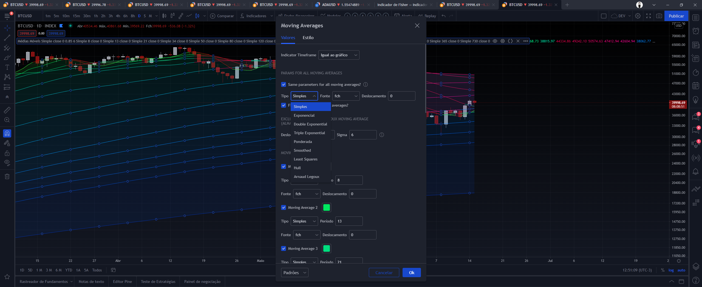
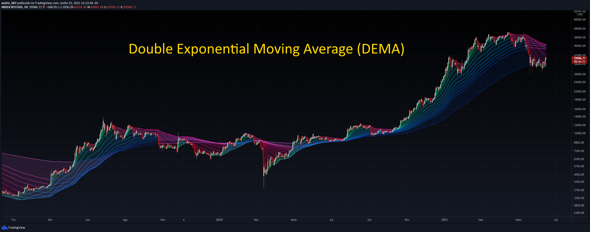
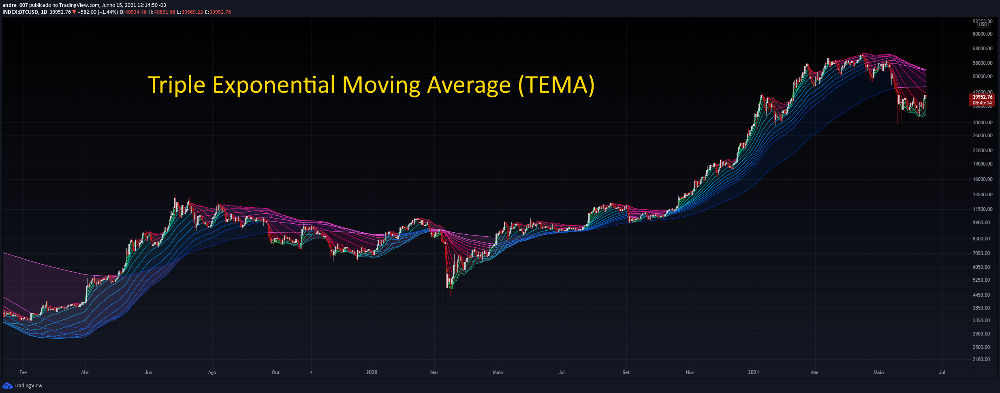
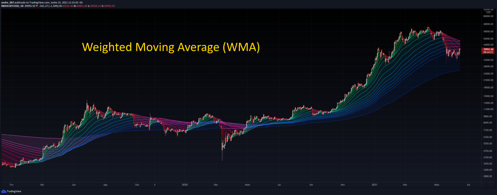
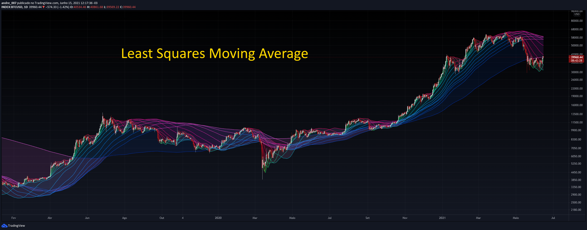
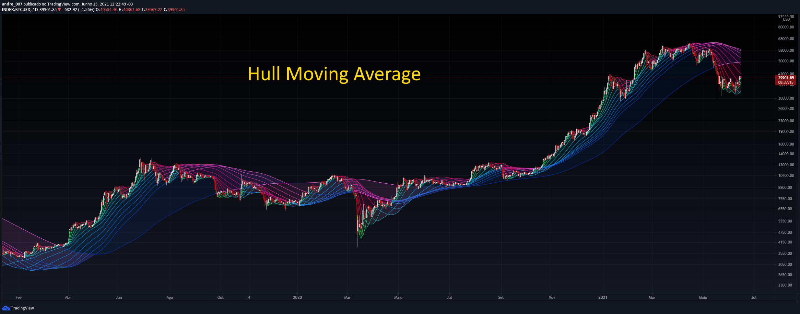

# 

## Moving Averages Collection

## Summary 💊

This is a collection of moving averages indicators.
It's developed in PineScript for the technical analysis platform of **TradingView**.

## Motivation 💊

To use the different types of moving averages (for example: simple, exponential, etc.), it is necessary to insert each indicator separately.

This can be tedius, requiring the inclusion or removal of the indicators every time you want to make the change.

Basically, what this script does, is to allow the dynamic use of these indicators.
That is, it is possible to choose the type of moving average as needed, facilitating the comparison and creation of setups.

## Caution 💊

No technical indicators are 100% accurate as they can sometimes generate false signals.

You should never rely on a single indicator and always use a range of them when making trading decisions.

---

## How to use this tool 💊

Simply choose the type desired as the figure.
In all are fourteen moving averages.
There is also the possibility of choosing the indidual type of each.

---

## Definitions 💊

### 1. Moving Averages 📈

The moving average (MA) is a delayed (or reactive) price-based indicator that displays the average price of a title for a defined period of time.
A moving average is a good way to evaluate the moment, confirm trends and set support and resistance areas.
Essentially, the moving averages soften the "noise" when trying to interpret graphics.
Noise is composed of price and volume fluctuations.
As a moving average is a delay indicator and reacts to events that have already occurred, It is not used as a predictive indicator, but as an interpretive indicator, used for confirmations and analyzes.
In fact, moving averages are the basis of several other known technical analysis tools such as Bollinger bands and MACD.

### 2. Simple Moving Average (SMA) 📈

The Simple Moving Average is an arithmetic moving average calculated by adding recent prices and then dividing then by the number of time periods in the calculation average.
This average is a non-weighted moving average, so this means that every day in the dataset they have equal importance and have the same weight.
Although old, it is a very efficient indicator to demonstrate supports and resistances and if the market is in a high, low or lateral tendency.

### Exponential Moving Average (EMA) 📈

The Exponential Moving Average (EMA) is a specific type of moving average that points towards the importance of the most recent data and information from the market.
It’s exponential, weighting the most recent prices more than the less recent prices.

Although using the Exponential Moving Average has a lot of advantages when analyzing market trends,
it is also uncertain whether or not the use of most recent data points truly affects technical and market analysis.
In addition, the EMA relies on historical data as its basis for operating and because news, events,
and other information can change rapidly the indicator can misinterpret this information by weighting the current prices higher than when the event actually occurred.

### Double Exponential Moving Average (DEMA) 📈

The Double Exponential Moving Average is a technical indicator that uses two moving averages to help confirm uptrends when price moves above average, and confirm downtrends when the price moves below average. A trend change might be occurring when the price moves in a direction away from the average. In addition, moving averages can be used to signify support and/or resistance territories.

The Double EMA has a quicker response when compared with traditional EMAs and can be used in the same ways. Remember that if you are using Double EMAs that it reacts quicker and therefore you should be planning your strategies around this information - alterations may be in order.

Traditional moving averages are good to use to identify trends in markets, but they don’t give much data when prices are choppy or not smooth. When price crosses the moving average or Double EMA, it is difficult to determine results and decide on when a trade will be profitable.

For this reason, it is great to pair the Double EMA with other technical indicators, or other price and/or fundamental analysis tools. By pairing the Double EMA, investors and traders can better determine market trends while looking at the big picture, and not getting hung up on the limitations or focusing on one sole indicator.

Reducing lag can be beneficial in some instances, such as if there is a reversal in actual price. It can help get a trader out quickly and before any major losses occur. However, reduced lag may also result in something called overtrading; when an indicator provides a trader with too many signals at once. An indicator that has less lag is also more susceptible to reacting to small shifts in price that would normally not have a large effect. So remember that lag can be good at times, but at others it can really get in the way. It is up to the trader to decide whether or not lag is something they want or need from their indicator.

### Triple Exponential Moving Average (TEMA) 📈

The Triple Exponential Moving Average (EMA) indicator was created to make it easier for traders to determine strength or weakness without the traditional lag associated with regular moving averages (MAs). In order to accomplish this, the Triple EMA takes multiple EMAs of the original EMA and then subtracts lag from the result.

Although the Triple EMA is known by many traders as a great indicator for reducing lag, it still has its faults as is true for any other indicator. MAs, for example, are very useful for trending markets, when price direction is particularly strong. When trends are choppy and price direction is weak, MAs, and the Triple EMA as well, may generate false signals as price fluctuates and the direction is in flux.

The Triple Exponential Moving Average reduces lag, smooths price fluctuations, and is an alternative to other moving averages because of its different calculation. Its calculation takes multiple EMAs of the original EMA and then subtracts lag from the result.

### Weighted Exponential Moving Average (WMA) 📈

The weighted average is any mean multiplies factors to provide different weights for different data.
In the technical analysis, the weighted moving average represents, specifically, the value of weights that decrease arithymetically.
Thus, on a day X, the last day WMA has weight X, from the penultimate day has X-1 weight and so on until the day 0.

The weighted moving average is used to "solve" the problem of equal weights.
This indicator is calculated by the sum of all closing prices divided for a certain period of time and multiplying them from the sum of the values (weights) each day.
For example, for a powerful average of five days, today's closing price will be multiplied by five, yesterday per four and so on until the first day on the period of the period is reached.
These values are then added and divided by the sum of the multipliers.

### Smoothed Moving Average 📈

The Smoothed Moving Average compares recent prices to historical ones and makes sure they are weighed and considered equally.
The calculation of this indicator does not reference a specific or fixed period, rather uses all available data in the series for analysis. The Smoothed Moving Average differs from the Exponential Moving Average (EMA) because it’s generally used with a longer time period.

The Smoothed Moving Average compares recent prices to historical ones and ensures they are analyzed with equal weight. The indicator does not refer to a fixed period when calculating results, but rather it uses all data available and does not remove specific data points once they have passed a specific time threshold.

### Least Squares Moving Average 📈

Least Square Moving Average is also called Linear regression moving average.
Moving linear regression may look similar to a moving average, but differs in its calculation.
Moving averages are calculated using an average of closing prices, like with simple moving averages (SMA).
Alternatively, they can be calculated by assigning greater weights to more recent prices and proportionately lower weights to prices farther in the past and then averaging those together (in this case, the most common form is the exponential moving average, or EMA).

Moving linear regression takes a continuous series of linear regression line endpoints and joins them together.

Based on these different methodologies, moving linear regression tends to hug price a lot more closely than moving averages of the same periodicity.

### Hull Moving Average 📈

The Hull Moving Average (HMA) is a directional trend indicator. It captures the current state of the market and uses recent price action to determine if conditions are bullish or bearish relative to historical data.

The Hull differs from more traditional trend indicators like the Exponential Moving Average (EMA) and the Simple Moving Average (SMA). It is designed to reduce the lag often associated with those MAs by providing a faster signal on a smoother visual plane.

The Hull Moving Average (HMA) is a quick and smooth moving average that is distinct in its own nature. The HMA attempts to remove lag in its entirety, while simultaneously improving upon smoothing.

### Arnaud Legoux Moving Average (ALMA) 📈

The ALMA is a technical analysis tool that aims to give investors and traders a more reliable trading signal by reducing the noise that can interfere with traditional moving averages. It eliminates the small fluctuations in an asset price to make the trend clearer.

The ALMA reduces price lag and creates a smoother line than other moving averages. Rather than a straightforward moving average for a certain period, it applies a moving average twice – from left to right as well as right to left.

The ALMA is a relatively new technical indicator, as many of them were developed during the 1970s, but it has quickly become popular. Arnaud Legoux and Dimitrios Kouzis Loukas developed the average in 2009 as they sought to address the weaknesses of simple moving averages (SMAs) and exponential moving averages (EMAs). They were inspired by Gaussian filters, which remove detail and noise to create a smooth image.

Legoux and Kouzis Loukas aimed to provide a leading indicator, as SMAs, EMAs and Smoothed Moving Averages (SMMAs) are considered lagging indicators.

